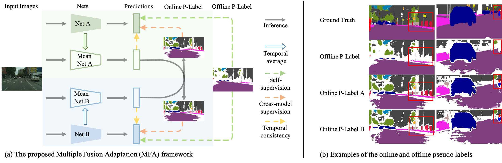

<!--
 * @Author: Kai Zhang
 * @Date: 2021-11-09 20:50:29
 * @LastEditors: Please set LastEditors
 * @LastEditTime: 2022-02-17 15:57:27
 * @Description: README for MFA
-->
# Multiple Fusion Adaptation: A Strong Framework for Unsupervised Semantic Segmentation Adaptation (BMVC 2021, official Pytorch implementation)

### [Paper](https://arxiv.org/abs/2112.00295)
<!-- <br> -->
[Kai Zhang](),  [Yifan Sun](), [Rui Wang](), [Haichang Li]() and [Xiaohui Hu]().
<!-- <br> -->

## Updates
***17/2/2022***
1. The problem that the learning rate does not decay as expected after the warmup stage is fixed. Thanks to [Pan](22051408@zju.edu.cn) for spotting this problem and suggesting a fix.

## Abstract
>This paper challenges the cross-domain semantic segmentation task, aiming to improve the segmentation accuracy on the unlabeled target domain without incurring additional annotation. Using the pseudo-label-based unsupervised domain adaptation (UDA) pipeline, we propose a novel and effective Multiple Fusion Adaptation (MFA) method. MFA basically considers three parallel information fusion strategies, i.e., the cross-model fusion, temporal fusion and a novel online-offline pseudo label fusion. Specifically, the online-offline pseudo label fusion encourages the adaptive training to pay additional attention to difficult regions that are easily ignored by offline pseudo labels, therefore retaining more informative details. While the other two fusion strategies may look standard, MFA pays significant efforts to raise the efficiency and effectiveness for integration, and succeeds in injecting all the three strategies into a unified framework. Experiments on two widely used benchmarks, i.e., GTA5-to-Cityscapes and SYNTHIA-to-Cityscapes, show that our method significantly improves the semantic segmentation adaptation, and sets up new state of the art (58.2% and 62.5% mIoU, respectively).

## Installation
Install dependencies:
```bash
pip install -r requirements.txt
```

## Data Preparation 
Download [Cityscapes](https://www.cityscapes-dataset.com/), [GTA5](https://download.visinf.tu-darmstadt.de/data/from_games/) and [SYNTHIA-RAND-CITYSCAPES](http://synthia-dataset.net/downloads/).

## Inference Using Pretrained Model

<details>
  <summary>
    <b>1) GTA5 -> Cityscapes</b>
  </summary>
  
Download the [pretrained model](https://drive.google.com/file/d/1gtV6D9tbGF11Es4yKyRX0IaHPZkKU7t9/view?usp=sharing) (55.7 mIoU) and save it in `../cache/mfa_result`. Then run the command 
```bash
python test.py --config_file configs/mfa.yml
```
</details>

<details>
  <summary>
    <b>2) SYNTHIA -> Cityscapes</b>
  </summary>
  
Download the [pretrained model](https://drive.google.com/file/d/10-TZJ1E1HUkXKUJqykkpjGeWnVTwUB9m/view?usp=sharing) (58.7 mIoU for 13 categories) and save it in `../cache/mfa_syn_result`. Then run the command 
```bash
python test.py --config_file configs/mfa_syn.yml
```
</details>

## Training
To reproduce the performance, you need 2 GPUs with no less than 15G memory.
<details>
  <summary>
    <b>1) GTA5 -> Cityscapes</b>
  </summary>
   
- **SSL.** Download [warmup model A](https://drive.google.com/file/d/1om6O0zEBzkTbxedckVRCy2bn0ttLoZT1/view?usp=sharing)(Trained by [FDA](https://github.com/YanchaoYang/FDA)), save it in `../pretrain/FDA`. Download [warmup model B](https://drive.google.com/file/d/1Etz4u6VHBWIunARf9iyrUA3CA8Gleans/view?usp=sharing)(Trained by [SIM](https://github.com/SHI-Labs/Unsupervised-Domain-Adaptation-with-Differential-Treatment)), save it in `../pretrain/SIM`.
    * Download [pseudo label](https://drive.google.com/file/d/1eeop1qf_umeRiRU9MpYHvmZzWUcoAPBj/view?usp=sharing), save it in  `./data/Cityscapes/`.
    * Train stage.
    ```bash
    python train.py --config_file configs/mfa.yml -g 2
    ```
    
</details>


<details>
  <summary>
    <b>2) SYNTHIA -> Cityscapes</b>
  </summary>

- **SSL.** Download [warmup model A](https://drive.google.com/file/d/17NHeedNLrhQCD1UCOZPbhcr5K37qH0z6/view?usp=sharing) (Trained by [FDA](https://github.com/YanchaoYang/FDA)), save it in `../pretrain/FDA_synthia`. Download [warmup model B](https://drive.google.com/file/d/1c3Obzgn1L9tnzGBp1LKG1hgo2WM-KydU/view?usp=sharing)(Trained by [SIM](https://github.com/SHI-Labs/Unsupervised-Domain-Adaptation-with-Differential-Treatment)), save it in `../pretrain/SIM_synthia`.
    * Download [pseudo label](https://drive.google.com/file/d/1tvNiQngMiNjS0IOKGKLix-NnKXiy78vF/view?usp=sharing), save it in  `./data/Cityscapes/`.
    * Train stage.
    ```bash
    python train.py --config_file configs/mfa_syn.yml -g 2
    ```
</details>

## Citation
If you like our work and use the code or models for your research, please cite our work as follows.
```
@article{zhang2021multiple,
  title={Multiple Fusion Adaptation: A Strong Framework for Unsupervised Semantic Segmentation Adaptation},
  author={Zhang, Kai and Sun, Yifan and Wang, Rui and Li, Haichang and Hu, Xiaohui},
  journal={arXiv preprint arXiv:2112.00295},
  year={2021}
}
```

## License

The codes and the pretrained model in this repository are under the MIT license as specified by the LICENSE file. 
## Acknowledgments
This code is adapted from [image_seg](https://github.com/whut2962575697/image_seg).  
We also thank to [FDA](https://github.com/YanchaoYang/FDA), [SIM](https://github.com/SHI-Labs/Unsupervised-Domain-Adaptation-with-Differential-Treatment), and [ProDa](https://github.com/microsoft/ProDA).
